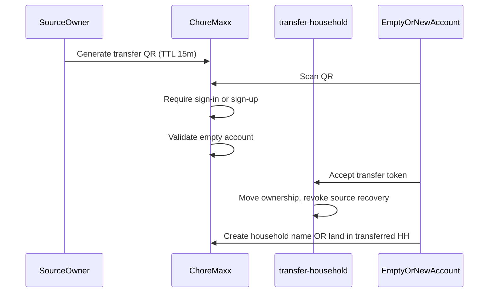

# Support, recovery, email, transfer & premium UI — implementation plan

Locked from product review (2026-10-05). **Default choices** are stated explicitly; adjust only if product says otherwise.

---

## Decisions (confirmed)

| Topic | Decision |
|--------|----------|
| Who can cancel scheduled deletion / recover | **Owner or admin** on that household (not owner-only). |
| Household transfer | **QR only** (no support-ticket transfer). Recipient must be **new account** or **empty account** (no active household / only recoverable shell). After transfer: **one household mode**, source account **cannot recover** transferred household. |
| Feedback email | **Resend** → `support@choremaxx.app` (existing `send-support-feedback`). |
| Purchase / credit receipts | **Resend** to user email — including **mock credit buys in Expo Go** before Apple IAP. |
| Deletion reminders | Email ladder at **T−7d, T−3d, T−24h, T−1h11m** before purge; user can **opt out of further reminders**; **accelerated permanent delete** requires confirmation email with **up to 24h** delay. |
| Premium UI | Onboarding paywall (`/premium`) stays directionally good; add **monthly/yearly price animation toggle**. Settings **Premium section** (`section === 'premium'`) **full visual redo** to match Poppins/House rules glass cards. |
| Support UI | Keep current layout; add **selectable errors**, optional **categories**, **screenshot attach**, richer **non-PII diagnostics** in payload. |
| Post-delete touch bug | **P0 fix**: after delete/switch/leave flow, app must not leave Settings modal with `wheelDragging` or blocking overlays. |
| UI quality | **Every new or touched screen** must match current Choremaxx aesthetics (Poppins / House rules / Credits tier). **Three passes** per surface: build → visual polish → functional QA in Expo Go. |

**Open product knob (see bottom):** total grace length from schedule → purge (**7 days** vs **30 days**) while keeping the four reminder offsets relative to purge time.

---

## Phase 1 — Support & error reporting (extend existing)

**Already shipped:** [`app/support.tsx`](../app/support.tsx), [`lib/errors/error-log.ts`](../lib/errors/error-log.ts), [`lib/support/send-feedback.ts`](../lib/support/send-feedback.ts), edge [`send-support-feedback`](../supabase/functions/send-support-feedback/index.ts).

### 1.1 Error taxonomy

- Add `category` to `AppErrorEntry`: `tasks` | `rewards` | `calendar` | `grocery` | `poppins` | `billing` | `settings` | `network` | `unknown`.
- Map at record time in [`orbit-alert.tsx`](../components/orbit/orbit-alert.tsx), [`friendly-error.ts`](../lib/errors/friendly-error.ts), and store catch sites (task complete, reward claim, etc.).
- Display category chip on Support cards; filter optional later.

### 1.2 Selective attach + diagnostics

- Support UI: checkbox per saved error (default **newest selected**); send only selected IDs.
- Extend payload (non-PII): `appVersion`, `platform`, `householdId`, `memberRole`, optional **counts** (open tasks, pending rewards) from store snapshots — **no member names, no task titles, no transcripts**.
- Optional `contextIds`: hashed or truncated task/reward IDs only when user expanded an error that recorded them.

### 1.3 Screenshots

- `expo-image-picker` (already in stack or add): attach 0–3 images; upload to Supabase Storage `support-uploads/` (RLS: auth user); edge function sends **signed URLs** in Resend body (not attachments if size limits bite).

### 1.4 Resend HTML for support

- New template [`emails/support-received.tsx`](../emails/support-received.tsx) (user auto-reply) + plain-text inbox copy for team.
- Team email remains `SUPPORT_INBOX`; user gets “We got your note” with ticket ref.

---

## Phase 2 — Transactional email (credits, subscription, deletion)

### 2.1 Edge functions (Resend + React Email)

| Function | Trigger | Template |
|----------|---------|----------|
| `send-credit-receipt` | After `grantTokenPack` (mock + real) | New `emails/credit-purchase.tsx` — congrats, amount, order id, “never expire” line |
| `send-subscription-receipt` | After mock/real `purchasePremium` | Extend [`emails/subscription-started.tsx`](../emails/subscription-started.tsx) |
| `send-deletion-reminder` | Cron / scheduled job | New `emails/household-deletion-reminder.tsx` (stage: 7d / 3d / 24h / 1h11m) |
| `send-deletion-confirmed` | Accelerated delete confirmed | New `emails/household-deletion-final.tsx` |
| `send-deletion-cancelled` | Cancel recovery | Short confirmation |

**From addresses:** `Choremaxx <noreply@choremaxx.app>`; **Reply-To** `support@choremaxx.app` for receipts.

### 2.2 Wire credits (mock now)

- [`app/poppins-credits.tsx`](../app/poppins-credits.tsx): after successful `purchaseTokens`, invoke `send-credit-receipt` with pack, tokens, order/receipt id, household name.
- Keep on-device receipt sheet; email is the real confirmation for testing before StoreKit.

### 2.3 Test harness

- Script or Settings → Developer (admin): “Send test credit / subscription / deletion email” to signed-in user.
- Document secrets: `RESEND_API_KEY`, `RESEND_FROM_EMAIL`, `SUPPORT_INBOX`, `BILLING_CC` optional.

---

## Phase 3 — Household deletion & recovery

### 3.1 Policy & SQL

- Replace `HOUSEHOLD_DELETION_GRACE_DAYS = 15` with **`HOUSEHOLD_DELETION_GRACE_DAYS = 7`** (default until product confirms 30).
- `deletion_scheduled_for` = **purge at** (unchanged semantics).
- New columns: `deletion_reminder_opt_out`, `deletion_accelerated_at`, `deletion_email_stage`.
- RPC `request_household_deletion`: allow **owner OR admin** (`role IN ('owner','admin')`).
- RPC `cancel_household_deletion`: same.
- RPC `request_immediate_household_deletion`: sets accelerated flag; sends confirm email; purge only after token confirm (24h max).

### 3.2 Reminder job

- Supabase cron or `pg_cron` edge worker: hourly scan households with pending purge; send next stage email; respect opt-out.

### 3.3 Recovery UI (recoverable households only)

- New route **`/household-recovery`** (or welcome branch): shown when membership list has **recoverable** row (scheduled purge, named household) and user is owner/admin.
- **Not shown** for brand-new users with no history.
- Hero: [`components/orbit/poppins-hourglass.tsx`](../components/orbit/poppins-hourglass.tsx) adapted → **`HouseholdRecoveryHourglass`** (same motion language as Poppins orb: breathe, gradient sand, live countdown to purge).
- Actions: **Cancel deletion** (recover), **Delete permanently now** (starts 24h confirm flow), **Opt out of reminder emails**.

### 3.4 Delete flow copy

- Update [`app/delete-household.tsx`](../app/delete-household.tsx) + Settings banner to describe **email ladder** and admin recovery.

### 3.5 P0 — Touch lock after switch/delete

- Audit [`app/settings.tsx`](../app/settings.tsx) `wheelDragging` / modal `gestureEnabled`.
- After `switchHousehold` from delete done: reset wheel state; `router.replace('/(tabs)')`; refresh store boot.
- Repro case: schedule delete on HH B, switch from HH A → fix any full-screen pointerEvents trap.

---

## Phase 4 — QR household transfer

### 4.1 Flow

### 4.2 Empty-account rules

- **Eligible:** auth user with **zero active memberships**, OR only membership is **recoverable scheduled-delete** household they own.
- **Ineligible:** user with a live household → show “Use an empty account” + sign out CTA.

### 4.3 Post-transfer

- Source account: membership removed; **transfer token burned**; no QR recovery.
- Destination: single active household; normal app.

### 4.4 UI placement

- Settings → House → **Transfer ownership** (owner only), generates QR + share sheet.
- Scanner: extend [`invite-qr-scanner.tsx`](../components/orbit/invite-qr-scanner.tsx) with `orbit://transfer-household?token=`.

---

## Phase 5 — Premium & payment placement

### 5.1 Settings Premium section redo

- Replace plain `SectionCard` + gray buttons in [`app/settings.tsx`](../app/settings.tsx) `section === 'premium'` with same patterns as Poppins settings: gradient hero, entitlement line, single primary CTA, restore as text row.

### 5.2 Paywall animation

- [`components/orbit/premium-paywall.tsx`](../components/orbit/premium-paywall.tsx): segmented **Monthly / Yearly** with animated price crossfade (Reanimated); fix copy bug “300 a month, 300 a day” → use `PREMIUM_ALLOWANCE_COPY` / daily cap from constants.

### 5.3 Strategic entry points (no duplicate ugly sheets)

| Scenario | Route |
|----------|--------|
| Onboarding gate | `/premium?source=onboarding` |
| Settings | Inline premium section → full `/premium?source=settings` |
| Out of actions | Existing Poppins paused → Credits + Premium link |
| Post–credit buy | Success → optional Premium upsell (soft) |

---

## Phase 6 — QA passes

1. **Email:** mock credit buy → inbox receipt; deletion stages in staging with shortened cron.
2. **Support:** select 2 of 5 errors + screenshot → Resend inbox + user ack.
3. **Recovery:** admin cancels deletion; hourglass countdown matches server time.
4. **Transfer:** full QR path on two test accounts; source cannot recover.
5. **Regression:** delete → switch HH → tabs usable; Premium section matches design.

---

## Suggested branch split

1. `cursor/support-feedback-v2-c30d` — Phase 1 + support HTML  
2. `cursor/transactional-email-c30d` — Phase 2  
3. `cursor/household-recovery-c30d` — Phase 3 + touch fix  
4. `cursor/household-transfer-qr-c30d` — Phase 4  
5. `cursor/premium-ui-polish-c30d` — Phase 5  

Base: `cursor/make-v31` (or latest merged make branch).

---

## One product confirmation

**Total grace from “Schedule deletion” to permanent purge:**

- **Plan default: 7 days**, with reminder emails at **7d, 3d, 24h, and 1h11m before purge** (four emails; first may coincide with schedule if purge is exactly 7d out).
- If you want **30 days** of recovery with reminders only in the **final 7 days**, say so — SQL constant and cron logic change, not the rest of the plan.
