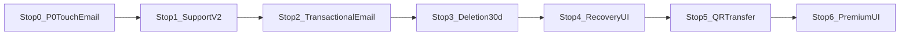
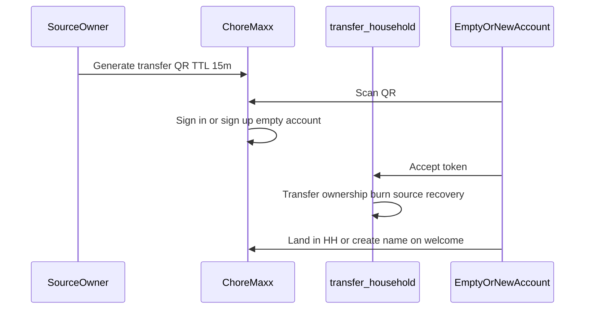

# Support, recovery, email, transfer & premium — master plan

**Branch (single):** `cursor/fin-credits-advanced-c30d` → PR base `cursor/make-v31`  
**Product lock:** 2026-10-05 (+ grace **B** confirmed)

All work lands on **one branch**, in **ordered stops**. Each stop ends with commit + push + **three passes** (function → visual → regression) before the next stop starts.

---

## Decisions (locked)

| Topic | Decision |
|--------|----------|
| Deletion grace | **B — 30 days** from schedule to permanent purge. Reminder emails only in the **final 7 days**: **T−7d, T−3d, T−24h, T−1h11m** before purge. Opt out of remaining reminders; accelerated delete → confirm email (up to **24h**). |
| Recover / cancel schedule | **Owner or admin** on that household. |
| Transfer | **QR only** → **new or empty account** only; after transfer **one household**, source **cannot recover**. |
| Feedback | Resend → `support@choremaxx.app`; selectable errors + categories + screenshots. |
| Credits / subs email | Real Resend to user on **mock + real** buys before Apple. |
| Premium UI | Settings Premium section redo; paywall **monthly/yearly animation**. |
| Touch bug | **P0** after delete/switch — no Settings modal lock. |
| UI quality | Poppins / House rules / Credits aesthetics; **3 passes per stop**. |

---

## Delivery map (stops on `cursor/fin-credits-advanced-c30d`)

| Stop | Scope | Key paths |
|------|--------|-----------|
| **0** | P0 touch fix after delete/switch; mock **credit receipt** email wired | `app/settings.tsx`, `app/delete-household.tsx`, `send-credit-receipt`, `app/poppins-credits.tsx` |
| **1** | Support v2: categories, select errors, screenshots, HTML ack, diagnostics | `lib/errors/error-log.ts`, `app/support.tsx`, `send-support-feedback`, `emails/support-received.tsx` |
| **2** | Subscription + deletion email templates; test harness | `emails/credit-purchase.tsx`, `send-subscription-receipt`, admin test triggers |
| **3** | **30-day** grace SQL/RPC (admin cancel); reminder cron; delete copy | `lib/household/household-deletion.ts`, migration, `20260828120000_*` successor |
| **4** | Recovery route + **hourglass** UI; empty-account gate on welcome | `HouseholdRecoveryHourglass`, `app/household-recovery.tsx` |
| **5** | QR transfer generate/scan/accept edge function | Settings House, `transfer-household`, scanner |
| **6** | Premium settings + paywall animation + allowance copy fix | `app/settings.tsx`, `premium-paywall.tsx` |

---

## Stop 0 — P0 + first Resend proof

### Function
- Fix `wheelDragging` / modal gestures after `switchHousehold` from delete done (`settings.tsx`, store boot).
- Edge `send-credit-receipt`: React Email congrats + tokens + order id.
- Invoke from `poppins-credits.tsx` after `purchaseTokens` (mock path included).

### Visual (Pass 2)
- Credits success: brief toast or inline “Receipt emailed to …” matching Credits orange tone.

### Regression (Pass 3)
- `npm run typecheck`, `test:billing`, `topup-receipt.test.ts`
- Expo Go: buy mock pack → inbox email; delete HH → switch → tabs respond to touch.

---

## Stop 1 — Support & error reporting

**Existing:** [`app/support.tsx`](app/support.tsx), [`lib/errors/error-log.ts`](lib/errors/error-log.ts), [`send-support-feedback`](supabase/functions/send-support-feedback/index.ts).

- `category` on `AppErrorEntry`: tasks | rewards | calendar | grocery | poppins | billing | settings | network | unknown.
- Checkboxes on saved errors; send only selected; default newest checked.
- Non-PII meta: householdId, memberRole, app build, optional counts (no titles/names).
- Screenshots: image picker → Storage → signed URLs in Resend body.
- User auto-reply template `emails/support-received.tsx`.

**Passes:** send 2/5 errors + 1 screenshot; verify support inbox + user ack; Support UI matches Poppins group headers.

---

## Stop 2 — Transactional email (subscription + deletion stages)

| Edge function | Template |
|---------------|----------|
| `send-subscription-receipt` | Extend [`emails/subscription-started.tsx`](emails/subscription-started.tsx) |
| `send-deletion-reminder` | `emails/household-deletion-reminder.tsx` (stages 7d/3d/24h/1h11m) |
| `send-deletion-confirmed` | Accelerated purge confirm |
| `send-deletion-cancelled` | Recovery cancel |

Admin-only Settings dev row: fire test emails to signed-in user.

**Passes:** all four deletion stage templates render; mock premium trial triggers subscription email.

---

## Stop 3 — 30-day deletion policy (grace B)

- `HOUSEHOLD_DELETION_GRACE_DAYS = 30`; `deletion_scheduled_for` = purge instant.
- Reminder cron: only when `now >= purge - 7d` and stage not sent; ladder 7d → 3d → 24h → 1h11m.
- RPC: `request_household_deletion` / `cancel` for **owner OR admin**.
- `request_immediate_household_deletion` + 24h confirm token email.
- Update [`app/delete-household.tsx`](app/delete-household.tsx) + Settings banner copy (30 days + email ladder).

**Passes:** unit tests for days remaining; staging cron with shortened intervals; admin can cancel, owner can cancel.

---

## Stop 4 — Recovery UI (recoverable only)

- Route when membership has scheduled purge + user is owner/admin + named household.
- **Not** shown for brand-new users with no history.
- `HouseholdRecoveryHourglass` from [`poppins-hourglass.tsx`](components/orbit/poppins-hourglass.tsx) — breathe, gradient sand, live countdown to purge.
- Actions: Cancel deletion, Delete permanently now, Opt out of reminder emails.

**Passes:** countdown matches server; Pass 2 side-by-side with Poppins settings hero.

---

## Stop 5 — QR household transfer

- Empty account: zero active memberships OR only recoverable scheduled-delete shell.
- Post-transfer: source cannot recover; destination single HH.
- Settings → House → Transfer ownership (owner); scanner `orbit://transfer-household?token=`.

**Passes:** two test accounts; ineligible user sees empty-account message.

---

## Stop 6 — Premium UI polish

- Redo `section === 'premium'` in [`app/settings.tsx`](app/settings.tsx) — glass hero, one primary CTA, restore as secondary row (no gray blocks).
- [`premium-paywall.tsx`](components/orbit/premium-paywall.tsx): Monthly/Yearly segmented control + Reanimated price crossfade; fix allowance copy via `PREMIUM_ALLOWANCE_COPY` / daily cap.

**Passes:** onboarding + settings entry both on-brand; animation smooth on device.

---

## Design standard (every stop)

References: [`docs/design-system/`](docs/design-system/01-product-philosophy.md), Poppins settings panel, House rules, Credits cards.

| Pass | Goal |
|------|------|
| **1** | Logic, emails, navigation, no touch lock |
| **2** | Typography, glass, gradients, motion, haptics, empty/busy states |
| **3** | typecheck + targeted tests + Expo Go admin/member/empty paths |

No plain gray `SectionCard` buttons where the app uses glass groups.

---

## Final QA (after Stop 6)

1. Mock credit + subscription + deletion reminder emails in inbox.  
2. Support: selected errors + screenshot → Resend.  
3. 30d schedule → reminders only in last 7d; admin recovers via hourglass.  
4. QR transfer; source locked out of recovery.  
5. Premium UI matches household settings vibe.  
6. Delete → switch HH → full app touch works.

---

## PR strategy

- **One PR** on `cursor/fin-credits-advanced-c30d`, updated after each stop (draft until Stop 6 complete, or mark ready after Stop 0 if you want early review).
- Do **not** split into five feature branches unless product asks — all stops stack on this branch.
