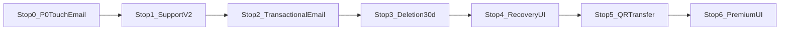
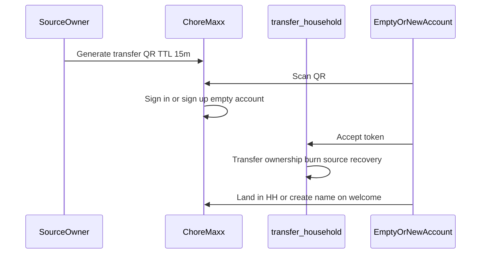

# Support, recovery, email, transfer & premium — master plan

**Branch (single):** `cursor/fin-credits-advanced-c30d` → PR base `cursor/make-v31`  
**Product lock:** 2026-10-05 (+ grace **B** confirmed)

All work lands on **one branch**, in **ordered stops**. Each stop ends with commit + push + **three passes** (function → visual → regression) before the next stop starts.

---

## Decisions (locked)

| Topic | Decision |
|--------|----------|
| Deletion grace | **B — 30 days** from schedule to permanent purge. Reminder emails only in the **final 7 days**: **T−7d, T−3d, T−24h, T−1h11m** before purge. Opt out of remaining reminders; accelerated delete → confirm email (up to **24h**). |
| Recover / cancel schedule | **Owner or admin** on that household. |
| Transfer | **QR only** → **new or empty account** only; after transfer **one household**, source **cannot recover**. |
| Feedback | Resend → `support@choremaxx.app`; selectable errors + categories + screenshots. |
| Credits / subs email | Real Resend to user on **mock + real** buys before Apple. |
| Premium UI | Settings Premium section redo; paywall **monthly/yearly animation**. |
| Touch bug | **P0** after delete/switch — no Settings modal lock. |
| UI quality | Poppins / House rules / Credits aesthetics; **3 passes per stop**. |

---

## Delivery map (stops on `cursor/fin-credits-advanced-c30d`)

| Stop | Scope | Key paths |
|------|--------|-----------|
| **0** | P0 touch fix after delete/switch; mock **credit receipt** email wired — **done** | `app/settings.tsx`, `app/delete-household.tsx`, `send-credit-receipt`, `app/poppins-credits.tsx` |
| **1** | Support v2: categories, select errors, screenshots, HTML ack, diagnostics — **done** | `lib/errors/error-log.ts`, `app/support.tsx`, `send-support-feedback`, `emails/support-received.tsx` |
| **2** | Subscription + deletion email templates; test harness — **done** | `send-subscription-receipt`, `send-household-deletion-email`, Settings Email tests |
| **3** | 30-day deletion grace B + reminder cron — **done** | `HOUSEHOLD_DELETION_GRACE_DAYS=30`, `20261005140000_household_deletion_v2.sql`, `household-deletion-cron` |
| **4** | Recovery route + hourglass UI — **done** | `HouseholdRecoveryHourglass`, `app/household-recovery.tsx`, welcome empty-account gate |
| **5** | QR household transfer — **done** | Settings House, `transfer-household`, `accept-household-transfer`, scanner |
| **6** | Premium settings + paywall animation + allowance copy fix — **done** | `app/settings.tsx`, `premium-paywall.tsx` |

---

## Stop 0 — P0 + first Resend proof

### Function
- Fix `wheelDragging` / modal gestures after `switchHousehold` from delete done (`settings.tsx`, store boot).
- Edge `send-credit-receipt`: React Email congrats + tokens + order id.
- Invoke from `poppins-credits.tsx` after `purchaseTokens` (mock path included).

### Visual (Pass 2)
- Credits success: brief toast or inline “Receipt emailed to …” matching Credits orange tone.

### Regression (Pass 3)
- `npm run typecheck`, `test:billing`, `topup-receipt.test.ts`
- Expo Go: buy mock pack → inbox email; delete HH → switch → tabs respond to touch.

---

## Stop 1 — Support & error reporting

**Existing:** [`app/support.tsx`](app/support.tsx), [`lib/errors/error-log.ts`](lib/errors/error-log.ts), [`send-support-feedback`](supabase/functions/send-support-feedback/index.ts).

- `category` on `AppErrorEntry`: tasks | rewards | calendar | grocery | poppins | billing | settings | network | unknown.
- Checkboxes on saved errors; send only selected; default newest checked.
- Non-PII meta: householdId, memberRole, app build, optional counts (no titles/names).
- Screenshots: image picker → Storage → signed URLs in Resend body.
- User auto-reply template `emails/support-received.tsx`.

**Passes:** send 2/5 errors + 1 screenshot; verify support inbox + user ack; Support UI matches Poppins group headers.

---

## Stop 2 — Transactional email (subscription + deletion stages) — **done**

| Edge function | Template |
|---------------|----------|
| `send-subscription-receipt` | [`emails/subscription-started.tsx`](emails/subscription-started.tsx) |
| `send-household-deletion-email` (`kind=reminder`) | `emails/household-deletion-reminder.tsx` (stages 7d/3d/24h/1h11m) |
| `send-household-deletion-email` (`kind=confirmed`) | `emails/household-deletion-final.tsx` |
| `send-household-deletion-email` (`kind=cancelled`) | `emails/household-deletion-cancelled.tsx` |

Admin-only Settings **Email tests** row: fire test emails to signed-in user.
Mock premium trial on `/premium` triggers subscription email.

**Passes:** all four deletion stage templates render; mock premium trial triggers subscription email.

---

## Stop 3 — 30-day deletion policy (grace B) — **done**

- `HOUSEHOLD_DELETION_GRACE_DAYS = 30`; `deletion_scheduled_for` = purge instant.
- Reminder cron (`household-deletion-cron`): only when `now >= purge - 7d` and stage not sent; ladder 7d → 3d → 24h → 1h11m. Staging: `DELETION_REMINDER_STAGING=1`.
- RPC: `request_household_deletion` / `cancel_household_deletion` for **owner OR admin**.
- `request_immediate_household_deletion` + 24h confirm token email; `opt_out_household_deletion_reminders`; `purge_due_households`.
- Updated [`app/delete-household.tsx`](app/delete-household.tsx) + Settings banner (30 days + email ladder); admins can Undo.

**Passes:** unit tests for days remaining + ladder; staging cron with shortened intervals; admin can cancel, owner can cancel.

---

## Stop 4 — Recovery UI (recoverable only) — **done**

- Route `/household-recovery` when membership has scheduled purge + user is owner/admin + named household.
- **Not** shown for brand-new users with no history (`listRecoverableDeletions` / `canOpenHouseholdRecovery`).
- `HouseholdRecoveryHourglass` from [`poppins-hourglass.tsx`](components/orbit/poppins-hourglass.tsx) — breathe, gradient sand, live countdown to purge.
- Actions: Cancel deletion, Delete permanently now (24h confirm email), Opt out of reminder emails.
- Entry points: Settings banner, welcome splash (signed-in recoverable), household switcher, delete done.

**Passes:** countdown matches server; Pass 2 side-by-side with Poppins settings hero.

---

## Stop 5 — QR household transfer — **done**

- Empty account: zero active memberships OR only recoverable scheduled-delete shell.
- Post-transfer: source demoted to adult (cannot recover); destination becomes owner; deletion schedule cleared.
- Settings → House → Transfer ownership (owner); scanner `orbit://transfer-household?token=`.

**Passes:** two test accounts; ineligible user sees empty-account message.

---

## Stop 6 — Premium UI polish — **done**

- Redo `section === 'premium'` in [`app/settings.tsx`](app/settings.tsx) — glass hero, one primary CTA, restore as secondary row (no gray blocks).
- [`premium-paywall.tsx`](components/orbit/premium-paywall.tsx): Monthly/Yearly segmented control + Reanimated price crossfade; fix allowance copy via `PREMIUM_ALLOWANCE_COPY` / daily cap.

**Passes:** onboarding + settings entry both on-brand; animation smooth on device; `premium-ui.test.ts` + `test:billing`.

---

## Design standard (every stop)

References: [`docs/design-system/`](docs/design-system/01-product-philosophy.md), Poppins settings panel, House rules, Credits cards.

| Pass | Goal |
|------|------|
| **1** | Logic, emails, navigation, no touch lock |
| **2** | Typography, glass, gradients, motion, haptics, empty/busy states |
| **3** | typecheck + targeted tests + Expo Go admin/member/empty paths |

No plain gray `SectionCard` buttons where the app uses glass groups.

---

## Final QA (after Stop 6)

1. Mock credit + subscription + deletion reminder emails in inbox.  
2. Support: selected errors + screenshot → Resend.  
3. 30d schedule → reminders only in last 7d; admin recovers via hourglass.  
4. QR transfer; source locked out of recovery.  
5. Premium UI matches household settings vibe.  
6. Delete → switch HH → full app touch works.

---

## PR / merge / TestFlight strategy (locked)

- **Work branch:** `cursor/fin-credits-advanced-c30d` — all stops stack here; update [PR #96](https://github.com/Djoek47/Orbit/pull/96) after each stop.
- **Merge target:** `cursor/make-v31` — merge **only after Stop 6** is done and three-pass QA is green for every stop, so make-v31 holds the full fin + support + recovery + premium set.
- **Do not** open parallel feature branches for later stops.
- **TestFlight / EAS:** **not** until product explicitly says to push a build. No TF submit as part of stop work.
